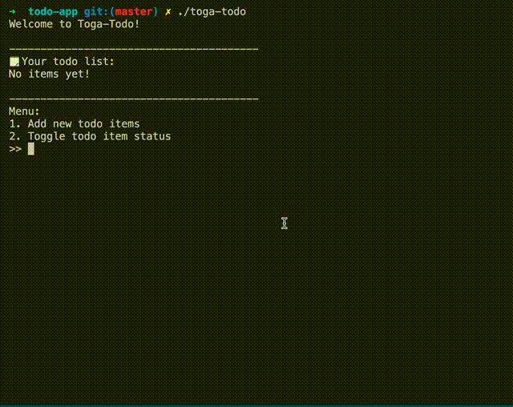
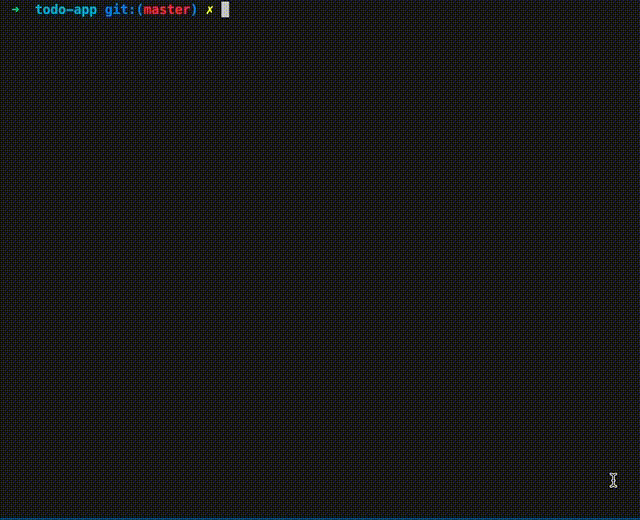

# Todo App

This is a simple CLI todo app that demonstrates how toga can be used in an application.

The todo app allows you to create a list of Todo items and toggle their "done" status.



Our todo app also has a brand-new feature for removing todo items. Since this is a brand new feature, we want to roll it out to users gradually. For now, we will only show this feature to users who have explicitly opted-in to experimental features and who are known to be loyal users.

We can accomplish this using a rule file like so:

```javascript
// allow-remove-item.json
{
  "and": [
    { "context": "showExperimentalFeatures" },
    {
      "gt": {
        "first": { "context": "loyaltyScore" },
        "second": 75
      }
    }
  ]
}
```

In our code, we use the toga SDK and this rule file to decide whether to show the "remove item" feature to our users like so:

```go
	context := map[string]interface{}{
		"showExperimentalFeatures": true,
		"loyaltyScore":             89.0,
	}
	removeItemEnabled := false
	err := sdk.EvalRuleFile("allow-remove-item.json", context, &removeItemEnabled)
	if err != nil {
		fmt.Printf("error calling toga sdk: %v\n", err)
	}
	if removeItemEnabled {
		commandRegistry.RegisterCommand(3, Command{
      ...
```

In a real application, `context` would likely be determined based on some properties of the user and the context in which they are using the application. This information can be pulled from anywhere, including a database or an external API.

With these hardcoded values, you can see that the "remove item" feature is enabled:

